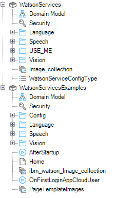
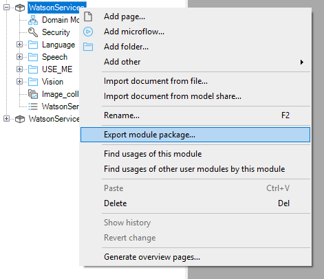
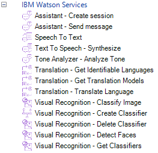

# IBM Watson Connector Suite

The IBM Watson Connector Suite is a collection of connectors that brings the [IBM Watson cognitive services](https://www.ibm.com/watson/developercloud/) to the Mendix platform.
For the latest documentation, please refer to our [Mendix Docs](https://docs.mendix.com/refguide/ibm/ibm-watson-connector).

## Try it out an example in IBM Cloud

1. Deploy an example application using the Mendix's IBM Watson Connector Suite by clicking on the following button (or follow [this documentation](documentation/deploy-ibm-cloud-button.md)).

   [](https://cloud.ibm.com/devops/setup/deploy?repository=https://github.com/mendix/IBM-Watson-Connector-Suite.git)

2. When possible, IBM Watson services should be automatically configured. To check the service, please refer to the [documentation here](documentation/usage.md).

## Getting Started with the connectors

With this project and you will be ready to go using the [Mendix Modeler](https://appstore.home.mendix.com/link/modelers/) to deploy locally or in the Mendix free tier (because this is an example app plus the connectors that point to several IBM Watson services).

### Prerequisities

* Mendix user account (sign up [here](https://www.mendix.com/try-now/))
* IBM Cloud account (sign up [here](https://cloud.ibm.com/registration))
* Mendix Modeler (only Windows-compatible) (download [here](https://appstore.home.mendix.com/link/modelers/))

### Features

These are the Watson APIs that have a connector implemented:

* Assistant (formerly Conversation) – [Create Session](https://cloud.ibm.com/apidocs/assistant-v2#create-a-session)
* Assistant (formerly Conversation) – [Send Message](https://cloud.ibm.com/apidocs/assistant-v2#send-user-input-to-assistant)
* Language Translation – [Translate](https://cloud.ibm.com/apidocs/language-translator#translate)
* Language Translation – [Get Identifiable Languages](https://cloud.ibm.com/apidocs/language-translator#list-identifiable-languages)
* Language Translation – [Get Models](https://cloud.ibm.com/apidocs/language-translator#list-models)
* Text to Speech – [Synthesize](https://cloud.ibm.com/apidocs/text-to-speech#synthesize-audio)
* Speech to Text – [Recognize Audio](https://cloud.ibm.com/apidocs/speech-to-text#recognize-audio)
* Tone Analyzer – [Analyze Tone](https://cloud.ibm.com/apidocs/tone-analyzer#analyze-general-tone)
* Visual Recognition – [Classify Image](https://cloud.ibm.com/apidocs/visual-recognition#classify-an-image)
* Visual Recognition – [Create Classifier](https://cloud.ibm.com/apidocs/visual-recognition#create-a-classifier)
* Visual Recognition – [Detect Faces](https://cloud.ibm.com/apidocs/visual-recognition#detect-faces-in-an-image)

### Installation

The project includes two modules that represent the list of available connectors and examples. Both modules are structured following the same categories used by IBM in its portfolio:



To be able to use the Watson Connector Suite in your project, you have to export the WatsonServices module and import it into the project where you want to use it:



Once you have imported the module into your project, you will have at your disposal the collection of new IBM Watson connectors to use in any microflow:



### Configuration

In your IBM Cloud console, every instance of a Watson service will have a section called "Service credentials", which will provide you the data in a format like this:

```
{
  "credentials": {
    "apikey": "<YOUR_API_KEY>",
    "url": "<SERVICE_URL_PROVIDED_BY_IBM_CLOUD>"
  }
}
```

Please follow the instructions in the example app to provide the service with the necessary credentials.

## Dependencies

The Watson Connectors Suite will install the following dependencies in your project's *userlib* folder:

* java-sdk-x.y.z-jar-with-dependencies.jar

> Note: Please be aware if you upgrade The Watson Connector Suite in your project, you will have to remove manually the old version of these dependencies.

## Known issues

* The ChatWidget doesn't show the username properly when the example app is deployed in a sandbox.
* Not all Watson services are available in all regions.
The the [Service availability](https://cloud.ibm.com/docs/resources/services_region.html#services_region) document contains a comprehensive list of services and the regions where they are available.

## Build Details

This was built with the following:

* Mendix Modeler 7.15.1
* Eclipse IDE Neon

## Versioning

We use [SemVer](http://semver.org/) for versioning. For the versions available, see the [tags on this repository](https://github.com/mendix/IBM-Watson-Connector-Kit/tags).

## License

This project is licensed under the Apache License v2 (for details, see the [LICENSE](LICENSE-2.0.txt) file).
